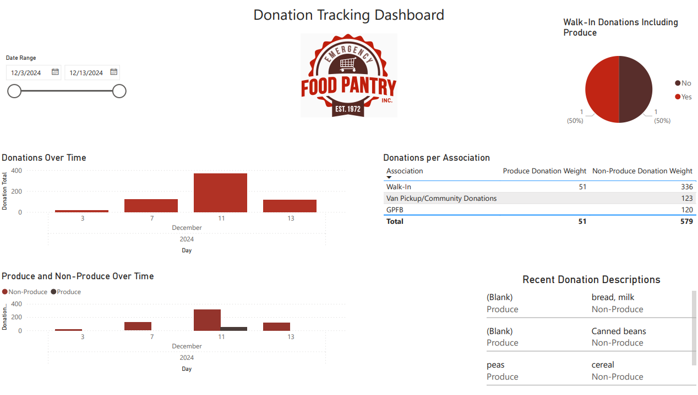

# EmergencyFoodPantryDataSolution--DATA-470

This Data Project involved creating a data pipeline for collecting, piping, visualizing, and analyzing data for the Emergency Food Pantry (EFP) to quantify their strategic priority initiatives, such as evaluating customer response data from questionnaires and tracking donation intake. We used the Microsoft Office Suite to build a data flow that encompasses data collection, piping, and visualization using Microsoft Forms, Power Automate, Excel, and Power BI. 

Date: December 2024

Members: Riley Fiske, Ella Anderson, Oleksii Kharchenko

[Read the Full Report Here](https://github.com/rdfiske17/EmergencyFoodPantryDataSolution--DATA-470/blob/main/Final_Report_Emergency_Food_Pantry.pdf)
